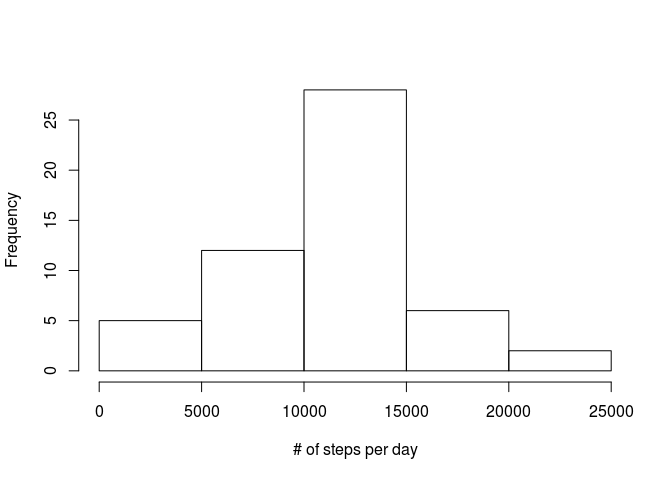
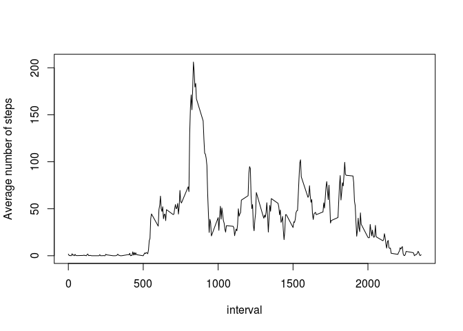
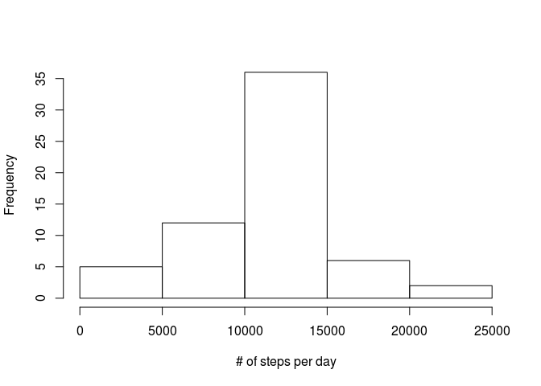
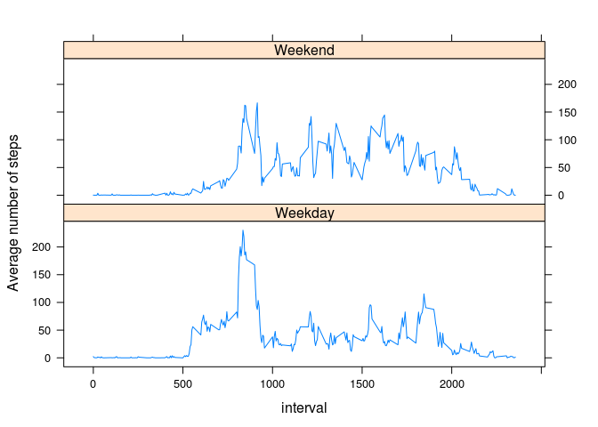

# Reproducible Research: Peer Assessment 1


## Loading and preprocessing the data

First, let's load the data from the zip file:


```r
data <- read.csv(unz('activity.zip','activity.csv'))
```


## What is mean total number of steps taken per day?

First, create a separate data set with removed NA's:


```r
data_no_na <-data[!is.na(data$steps),]
```

Then calculate the number of steps for each day by summing the steps that has the same date:


```r
library(plyr)
steps_per_day <- ddply(data_no_na, .(date), function(x) sum(x$steps))
```

Let's plot a histogram:


```r
hist(steps_per_day$V1,xlab="# of steps per day",main=NA)
```

 

The mean and the median of the total number of steps taken per day:


```r
mean(steps_per_day$V1,na.rm=TRUE)
```

```
## [1] 10766.19
```


```r
median(steps_per_day$V1,na.rm=TRUE)
```

```
## [1] 10765
```


## What is the average daily activity pattern?

Let's first transform our dataset to have the average daily activity pattern!


```r
interval_means <- ddply(data_no_na, .(interval), function(x) mean(x$steps))
```

The average daily activity pattern can be plotted to a line chart:


```r
plot(interval_means,type="l",ylab="Average number of steps")
```

 

The most active interval can be easily calculated then:


```r
interval_means[which.max(interval_means$V1),]$interval
```

```
## [1] 835
```

## Imputing missing values

The total number of NAs in the dataset:


```r
sum(is.na(data))
```

```
## [1] 2304
```

Then let's create a new dataset with the missed data calculated from the mean of the intervals throughout all days:


```r
data_inferred_nas <- data
data_inferred_nas$steps[is.na(data_inferred_nas$steps)] <- with(data_inferred_nas,ave(steps,interval,FUN=function(x) mean(x,na.rm=TRUE)))[is.na(data_inferred_nas$steps)]
```

Then recreate the previous histogram with the modified data set:


```r
steps_per_day_inferred_nas <- ddply(data_inferred_nas, .(date), function(x) sum(x$steps))
hist(steps_per_day_inferred_nas$V1,xlab="# of steps per day",main=NA)
```

 

And the mean and the median:


```r
mean(steps_per_day_inferred_nas$V1,na.rm=TRUE)
```

```
## [1] 10766.19
```


```r
median(steps_per_day_inferred_nas$V1,na.rm=TRUE)
```

```
## [1] 10766.19
```

In conclusion, the mean is the same, the median is a little different, and overall the frequency of the most frequent amounts went a bit higher.


## Are there differences in activity patterns between weekdays and weekends?

Add a factor indicating whether a day is weekday or weekend, then calculate the average steps per intervals


```r
data_inferred_nas$day<-as.factor(ifelse(weekdays(as.Date(data_inferred_nas$date)) %in% c("Saturday","Sunday"), "Weekend", "Weekday"))
weekdays_interval_means <- ddply(data_inferred_nas, .(interval,day), function(x) mean(x$steps))
```

Then make a line plot separated by weekend/weekdays:


```r
library(lattice)
xyplot(V1~interval | day,data=weekdays_interval_means, type="l",layout=c(1,2),ylab="Average number of steps")
```

 
